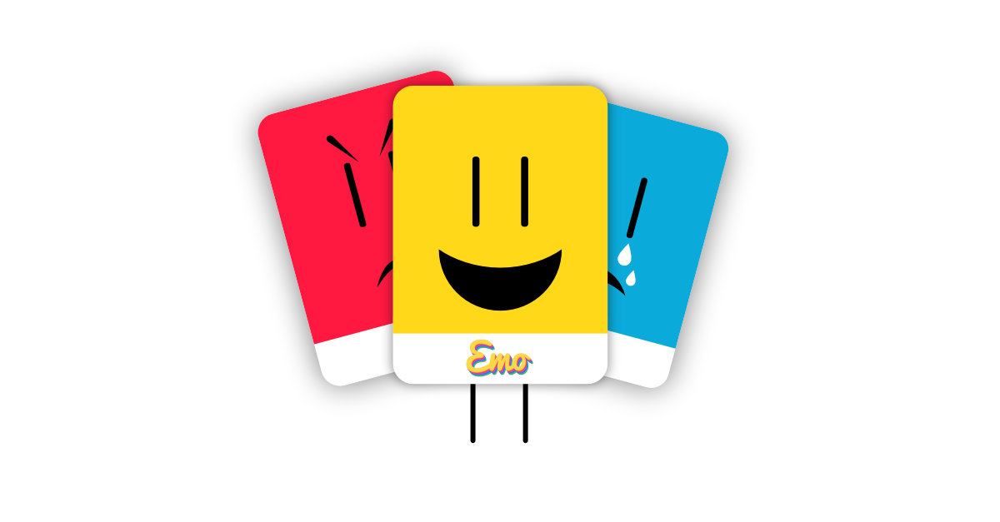

# Meet EMO!
Emo is a friend who can help your child express her/his emotions.
[Meet him here](https://arnofaure.github.io/emo/)

Visit the [wiki](https://github.com/arnofaure/emo/wiki) for more info.

## Made with...
Made only with HTML, CSS and the great [p5.js library](https://github.com/processing/p5.js)

## License
Emo was created by [@arnofaure](https://github.com/arnofaure) and his son Nil under [UNTIL](https://www.untilstudio.ca/) - Cultural & Educational Materials For Children.

Emo is under an  [Attribution-NonCommercial-NoDerivatives 4.0 International License](https://creativecommons.org/licenses/by-nc-nd/4.0/). Which means you are free to **Share** — **copy** and **redistribute** the material in any medium or format.

(CC BY-NC-ND 4.0) - 2017

### Disclaimer
This app is not intended to replace a specialist advice. I created this app with my son, I'm not a pediatrician and I don't have any official diploma in the psychology field. I'm just a father of a 6-year-old who wanted to let my son express his own feelings.
